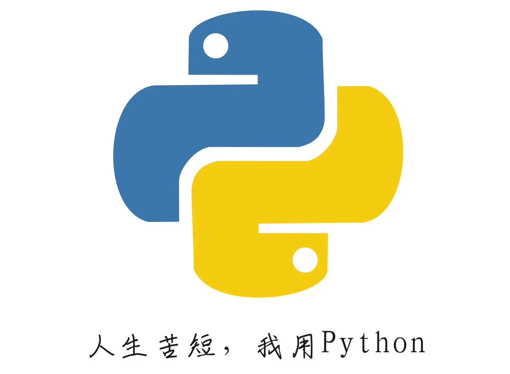

# 8388688.github.io

**Hello! I'm 8388688.**

[English](README_EN.md)

我是来自全宇宙——银河系——太阳系——地球——亚洲——中国的一名“初衷”生，我的初衷是~~好好学习，未来研发新一代的量子计算机，为国家建设做贡献~~

喜欢游戏和编程，喜欢创造，没事的时候也会胡思乱想。

讨厌的事：规章制度、油店老板、**郭\*源**。

> *讨厌学校的规章制度，但没有到无法容忍的程度.*

主要在用python

⚪。

-----
#### 最新动态

- \[2022-10-5\]simple_tools 更新至 v4.1-pre1

-----
#### 以下是链接

+ [本站展示界面](https://8388688.github.io/)

+ [用户界面](https://github.com/8388688/)

#### 工具包:

+ [simple_tools - 自制的python工具集](https://github.com/8388688/simple_tools)

-----
#### F4F 底下没有东西

底下确实没有东西
