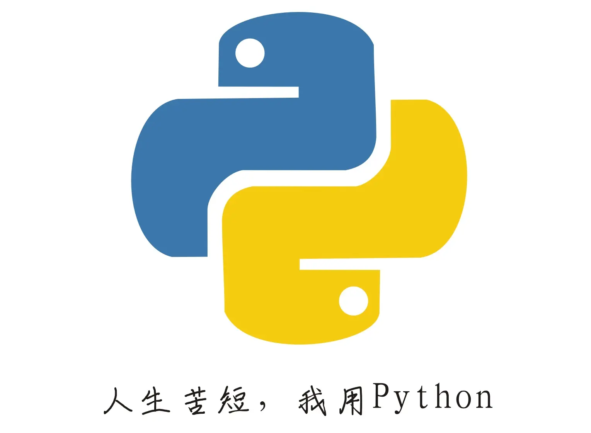

# 8388688.github.io

**Hello! I'm 8388688.**

[中文](README.md)

I am from the whole universe - galaxy - the sun - the earth - the Asia - China. I'm an "original intention" student. My original intention is ~~study hard and develop a new generation of quantum computers in the future to contribute to national construction~~

My favorite projection is playing games and programming, I like creative, and I often tkink something neaningless in my spare time, so I usually get confused.

Hatred: rules, oil boss、the girl named Guo。

> *Hate school rules, but not to the point of intolerance. *

I mainly use in python.

⚪。

-----
#### Activities

- \[2022-10-5\]simple_tools updated to v4.1-pre1

-----
#### Links

+ [本站展示界面](https://8388688.github.io/)

+ [用户界面](https://github.com/8388688/)

#### Package of tools:

+ [simple_tools - 自制的python工具集](https://github.com/8388688/simple_tools)

-----
#### F4F nothing in bottom.

Nothing in bottom, I said again.
